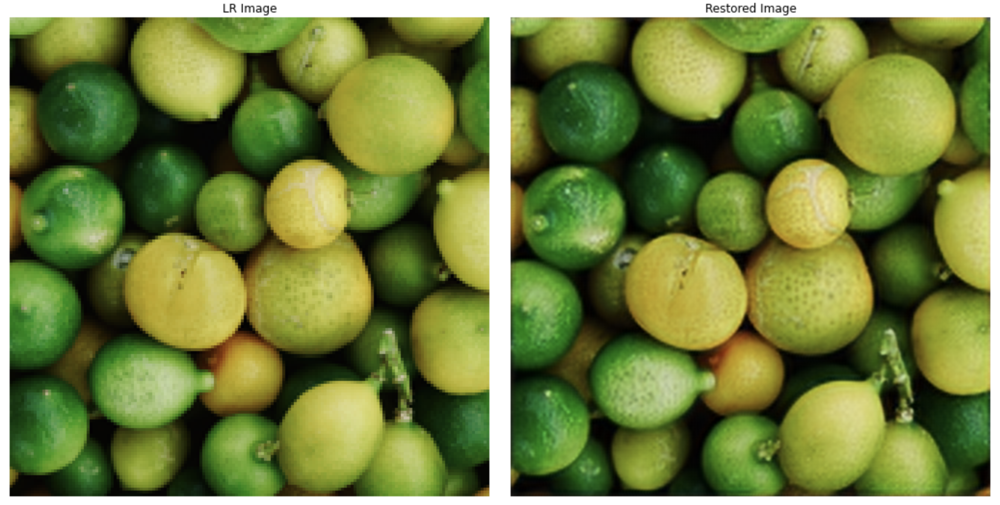
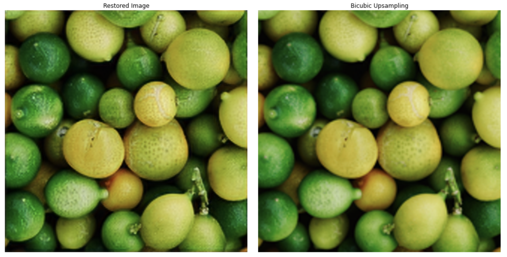

# Super Resolution with FSRCNN

Tensorflow 2 implementation of the Fast Super Resolution CNN described in paper [Accelerating the Super-Resolution Convolutional Neural Network](https://arxiv.org/abs/1608.00367). This project is a demonstraction for my blog post Learn To Reproduce Papers: Beginner’s Guide.

## FSRCNN Overview

FSRCNN is CNN-based approach for Super Resolution task. It is a single neural network that takes low resolution (LR) image as an input, "cleverly" upscales it and return high resolution (HR) image, that is N times larger. N is upscaling factor defined by used, in this project N=4.

FSRCNN is defined in the paper and in this project as FSRCNN(d,s,m), where d, s, m - are hyperparameters. Authors recommend using d=32, s=5, m=1 for real-time predictions, and d=56, s=12, m=4 for better restoration quality.

#### Difference with the original paper:

- RMSprop optimizer was used instead of SGD, because it helps model train faster. Added ReduceLROnPlateau and EarlyStopping callbacks.

- Model was trained on [DIV2K dataset](https://data.vision.ee.ethz.ch/cvl/DIV2K/). It is a newer and larger dataset, compared to those used in the paper - [T91](https://www.kaggle.com/ll01dm/t91-image-dataset) and [General-100](http://mmlab.ie.cuhk.edu.hk/projects/FSRCNN.html). I used only high resolution (HR) images from DIV2K, both train and validation, 900 images in total. I combined both train and validation parts into a single folder and created my custom train-val-test split by image ids: ids 1-700 for train, ids 701-800 for validation, ids 801-900 for test. Low resolution (LR) images are created from high resolution images by downsampling.

- RandomCrop, HorizontalFlip and ColorJitter image augmentation were used.


#### Model Results

- Model PSNR on the test set = 26.625
- How model input and output look like (on Test Set):



- FSRCNN vs bicubic upsamling:




## Project Structure

```
.
├── README.md
├── config.yaml
├── data
│   └── DIV2K_train_valid_HR
│       ├── 0001.png
│       ├── ...
│       └── 0900.png
├── notebooks
│   └── Inference.ipynb
├── requirements.txt
├── train.py
├── utils
│   ├── constants.py
│   ├── dataset.py
│   └── model.py
└── weights
    └── model.h5
```

- **utils/constants.py** - definition of constant like image size and upscaling factor
- **utils/dataset.py** - data loader for DIV2K dataset
- **utils/model.py** - model architecture
- **train.py** - script for training. 
- **config.yaml** - file with training parameters
- **weights/model.h5** - trained model weights
- **notebooks/Inference.ipynb** - notebook for inference and visualization

Download [DIV2K dataset](https://data.vision.ee.ethz.ch/cvl/DIV2K/) (train + validation parts), move all images into folder **data/DIV2K_train_valid_HR**.

## Usage

```
python3 train.py --config config.yaml
```

